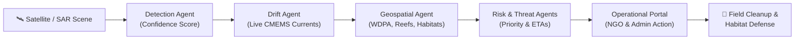
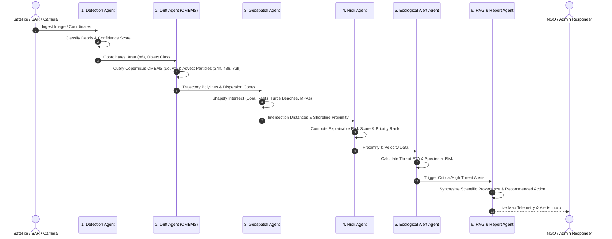

# OceanGuard AI — Comprehensive System Architecture, Roles & Operational Flow Guide

## 🌊 1. Executive Overview & Mission

**OceanGuard AI** is an operational marine debris intelligence and ecological shield platform. It automates the end-to-end pipeline from satellite/optical detection of ghost fishing gear and marine debris, through Lagrangian ocean drift prediction and automated ecological proximity screening, to NGO field intervention and incident recovery coordination.



---

## 👥 2. User Roles & Permission Matrix

The platform implements a streamlined role model designed for maritime safety and environmental response: **Admin** and **NGO**.

```
                        ┌─────────────────────────────────────┐
                        │      OceanGuard AI Command          │
                        │           (admin)                   │
                        └──────────────────┬──────────────────┘
                                           │
                    ┌──────────────────────┴──────────────────────┐
                    ▼                                             ▼
       ┌────────────────────────┐                    ┌────────────────────────┐
       │   Technical Oversight  │                    │   Field Interventions  │
       │  • Pipeline Execution  │                    │ • Incident Override    │
       │  • Copernicus / CMEMS  │                    │ • Global Audit Trail   │
       └────────────────────────┘                    └────────────────────────┘
                                                                  │
                                            ┌─────────────────────┘
                                            ▼
                        ┌─────────────────────────────────────┐
                        │    Environmental NGO Responder      │
                        │             (ngo)                   │
                        └──────────────────┬──────────────────┘
                                           │
                    ┌──────────────────────┴──────────────────────┐
                    ▼                                             ▼
       ┌────────────────────────┐                    ┌────────────────────────┐
       │ Human Verification (<70)│                   │ Actionable Cleanup (≥70)│
       │ • Geometry Inspection  │                    │ • Vessel Dispatch      │
       │ • Verify Debris        │                    │ • Threat Mitigation    │
       │ • Reject False Alarm   │                    │ • Operational Notes    │
       └────────────────────────┘                    └────────────────────────┘
```

### Role Comparison Matrix

| Functionality / Workflow | Environmental NGO (`ngo`) | Platform Admin (`admin`) |
|---|:---:|:---:|
| **Inspect Detection Geometry on Map** | ✅ Yes | ✅ Yes |
| **Verify Low-Confidence Detections (< 70%)** | ✅ Primary Responsibility | ✅ Full Access |
| **Reject False Alarms (Waves / Glint / Sea Foam)** | ✅ Primary Responsibility | ✅ Full Access |
| **Assign Response Teams & Interception Vessels** | ✅ Local Vessels & Crews | ✅ Any Crew / Fleet |
| **Update Incident States (`being_handled`, `resolved`)** | ✅ Yes | ✅ Yes |
| **Acknowledge & Mitigate Ecological Threat Alerts** | ✅ Yes | ✅ Yes |
| **Incident Audit Trail (`IncidentAction`) Logging** | ✅ Logged with Name & NGO | ✅ Logged with Name & Admin |
| **Cross-Organization Conflict Override** | ❌ Own Organization Scope | ✅ Full Global Authority |
| **Trigger Satellite Detection Pipeline (`POST /predict`)** | ❌ (View & Intervene Only) | ✅ Yes |
| **Live Oceanographic CMEMS Data Management** | ❌ Consumes Live Feed | ✅ Configures & Forces Refreshes |
| **User Registration & Account Management** | ❌ | ✅ Full Governance |

---

## 🤖 3. The Multi-Agent Pipeline Flow

The platform coordinates six specialized autonomous agents:



### Detailed Agent Responsibilities:

1. **Detection Agent (`app/detection/`)**:
   - Classifies maritime floating debris into `marine_debris`, `suspected_ghost_gear`, or `unknown_floating_object`.
   - Computes bounding area ($m^2$) and AI detection confidence ($0.0 - 1.0$).
2. **Drift Agent (`app/drift/`)**:
   - Authenticates with **Copernicus Marine Service (CMEMS)** to pull live zonal ($u_o$) and meridional ($v_o$) surface velocities from the global physical ocean forecast.
   - Computes Lagrangian particle trajectory positions at **24h**, **48h**, and **72h** horizons with expanding uncertainty probability envelopes.
3. **Geospatial Agent (`app/geospatial/`)**:
   - Executes spatial geometry intersections using Shapely with cached real-world GIS datasets:
     - UNEP-WCMC Global Distribution of Coral Reefs.
     - SWOT / OBIS Sea Turtle Rookeries (Olive Ridley nesting beaches).
     - WDPA Marine Protected Areas & Biosphere Reserves.
4. **Risk Agent (`app/risk/`)**:
   - Deterministic and explainable scoring algorithm assessing:
     $$\text{Risk Score} = w_1(\text{MPA Proximity}) + w_2(\text{Habitat Threat}) + w_3(\text{Debris Area}) + w_4(\text{Shoreline Proximity})$$
   - Classifies priority: `CRITICAL`, `HIGH`, `MEDIUM`, or `LOW`.
5. **Ecological Alert Agent (`app/alerts/`)**:
   - Determines exact arrival ETAs (in hours) and distance (in km) to sensitive marine habitats.
   - Dispatches live alert pins and ticker updates for imminent threats.
6. **RAG & Report Agent (`app/rag/`)**:
   - Pulls scientific reference citations (GCRMN, SWOT, WDPA) and generates structured actionable briefing reports for field teams.

---

## 🔄 4. Operational End-to-End Workflows

### Workflow A: Low-Confidence Verification Queue (`< 70%`)
```
AI Confidence < 70%
       ↓
Enters "Human Verification Queue" (Amber Alert)
       ↓
Responder clicks "Inspect Geometry ↗" (Camera pans to satellite coordinate on GIS Map)
       ↓
Decision Point:
   ├── "✓ Verify as Debris" ──► Status becomes "verified" ──► Moves to Actionable Stream
   └── "✕ Reject (False Positive)" ──► Status becomes "rejected" ──► Exits Queue
       ↓
Action recorded permanently in Incident Audit Trail with Responder Name & Organization
```

### Workflow B: High-Confidence Cleanup & Interception (`≥ 70%`)
```
High-Confidence Debris (≥ 70% or Verified)
       ↓
Enters "High-Confidence Cleanup Stream" (Orange Alert)
       ↓
Responder clicks "Assign Team / Vessel" ──► Enters vessel name & dispatch reason
       ↓
Status updated to "assigned"
       ↓
Field team intercepts debris ──► Responder marks "being_handled"
       ↓
Debris safely retrieved from ocean ──► Responder marks "resolved / recovered"
       ↓
Full audit trail archived with timestamp, responder name, and field recovery notes
```

### Workflow C: Ecological Threat Mitigation
```
Lagrangian Drift Trajectory intersects Marine Habitat / Reef within 72 hours
       ↓
System fires Ecological Alert Banner at top of GIS Dashboard
       ↓
NGO / Admin clicks "Locate ↗" or "Intervene"
       ↓
Opens Threat Telemetry (Impact ETA, Species at Risk, Scientific Citation)
       ↓
Step 1: Click "Acknowledge Threat" (Alert status changes from active → acknowledged)
       ↓
Step 2: Dispatch vessel to intercept drift path
       ↓
Step 3: Click "Mark Threat Mitigated / Resolved" once gear is secured
```

---

## 🗺️ 5. Interactive GIS Map Architecture

The frontend leverages **MapLibre GL** combined with **Deck.gl** 3D WebGL overlay:

1. **Basemap Switcher**:
   - **Carto Dark Matter**: High-contrast tactical night operations.
   - **Voyager Marine**: Clean daytime navigational maritime basemap.
   - **Ocean Satellite**: High-resolution photorealistic Esri World Imagery.
2. **Deck.gl Animated Currents Layer**:
   - Animates **847+ live ocean current velocity vectors** pulled directly from Copernicus Marine Service.
   - Dynamic particle trails indicate speed (m/s) and advection heading across the Arabian Sea, Bay of Bengal, and Equatorial Indian Ocean.
3. **Marine Telemetry Layers**:
   - Coral Reef boundaries (GCRMN cyan/teal polygons).
   - Marine Life Habitats (SWOT turtle beaches, whale corridors).
   - WDPA Marine Protected Areas (purple protection envelopes).
   - 24h / 48h / 72h drift cones with uncertainty probability halos.
   - Debris incident markers colored by lifecycle state.

---

## 🛡️ 6. Scientific Data Provenance & Reliability

To prevent simulated or fabricated data, all ecological calculations run against cached authentic geographic datasets:

| Dataset / Source | Reference Standard | Purpose in OceanGuard |
|---|---|---|
| **Copernicus Marine (CMEMS)** | Global Ocean Physics Analysis (`0.083°`) | Real-time ocean surface currents for particle advection |
| **UNEP-WCMC / GCRMN** | Global Coral Reef Monitoring Network v4.1 | Shallow-water and barrier reef threat detection |
| **SWOT / OBIS-SEAMAP** | State of the World's Sea Turtles (2024) | Endangered Olive Ridley nesting beach protection |
| **WDPA** | World Database on Protected Areas | National marine park and sanctuary boundary screening |
| **NOAA GSHHG** | Global Self-consistent Hierarchical Shorelines | Vector coastline distance and beaching hazard calculations |

---

## 🔑 7. Demo Accounts & Verification Credentials

| Role | Email Address | Password | Organization | Intended Use |
|---|---|---|---|---|
| **NGO Responder** | `responder@oceanguard.org` | `responder123` | Ocean Guardians Marine NGO | Verification of low-confidence debris, vessel assignment & threat mitigation |
| **Platform Admin** | `admin@oceanguard.org` | `admin123456` | OceanGuard AI Command | Full technical control, multi-team oversight & global incident management |
