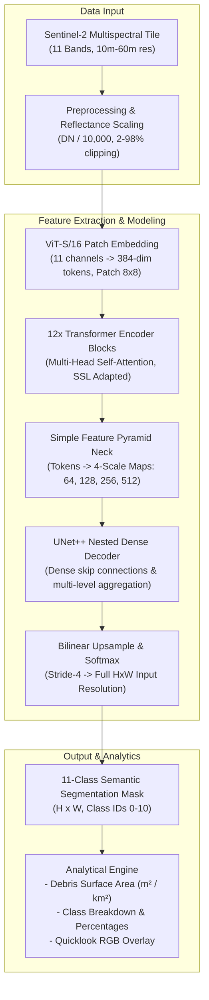

# Marine Satellite Segmentation: Architecture & Frontend Integration Guide

## 1. Executive Summary & Project Purpose

This project is a high-resolution remote-sensing computer vision pipeline designed for **automated detection, classification, and spatial monitoring of Marine Debris and Floating Macro-plastics** in coastal and open-ocean environments using **Sentinel-2 multispectral satellite imagery**.

Marine plastic pollution and macro-debris represent critical ecological threats. Identifying small-scale marine debris patches in satellite imagery is notoriously challenging due to:
1. **Spectral Confusion:** Marine litter signatures easily blend with sea foam, sun glint, Sargassum macroalgae, and natural organic matter (driftwood, pollen).
2. **Extreme Class Imbalance:** Marine debris occupies less than 0.01% of ocean surface pixels in any given satellite tile.
3. **Multi-resolution Spectral Bands:** Sentinel-2 Level-2A data features bands sampled across 10m, 20m, and 60m ground sampling distances (GSD).

This solution pairs a **Domain-Adapted Vision Transformer (ViT-Small)** with a **Simple Feature Pyramid Neck** and a **U-Net++ Nested Dense Skip Decoder** trained on harmonized benchmark datasets (**MARIDA**, **MADOS**) with Self-Supervised Learning (SSL Masked Autoencoder) on unlabeled **Indian Coastal** waters. The final checkpoint (`segmentation_best.pth`) achieves a top validation mean Intersection over Union (**val mIoU**) of **71.96%** across 11 marine classes.

---

## 2. System Architecture & Deep Learning Pipeline

### 2.1 High-Level Architectural Flow



---

### 2.2 Model Architecture Breakdown

| Component | Specification | Technical Rationale |
| :--- | :--- | :--- |
| **Input Channels** | 11 Sentinel-2 Bands (`B1, B2, B3, B4, B5, B6, B7, B8, B8A, B11, B12`) | Leverages coastal aerosol, visible, red edge, NIR, and SWIR bands to distinguish plastics from water and biological slicks. |
| **Backbone Encoder** | `ViTEncoder` (Vision Transformer Small / 16, patch size 8×8) | Global receptive field captures long-range contextual spatial relationships across vast water surfaces. |
| **Embedding Dimension** | 384 dimensions, 12 blocks, 6 attention heads | Balances representational power and computational efficiency for edge/cloud deployment. |
| **Domain Pretraining** | Masked Autoencoder (MAE) on Indian Coastal Sentinel-2 patches | Bridges domain shifts from standard ImageNet/terrestrial satellite models to open-water radiance characteristics. |
| **Feature Neck** | `SimpleFeaturePyramidNeck` | Convolutions and multi-scale resamplings map 1D ViT token outputs into a 4-level feature hierarchy (`64`, `128`, `256`, `512` channels). |
| **Decoder** | `UNet++` (Nested and dense skip connections) | Dense skip pathways bridge semantic gaps between encoder features and decoder resolution, recovering fine debris boundary details. |
| **Classification Head** | 1×1 Convolution (`64` channels $\rightarrow$ `11` classes) | Produces pixel-level classification logits at native resolution via bilinear interpolation. |

---

### 2.3 Semantic Classes (MARIDA / MADOS Harmonized)

The model is trained to segment 11 distinct marine surface categories:

| ID | Class Name | Color Palette (RGB) | Description / Significance |
|:---|:---|:---|:---|
| **0** | **Marine Debris** | `[0, 0, 0]` | **Primary Target**: Plastic slicks, floating litter, net clusters. |
| **1** | **Dense Sargassum** | `[255, 0, 0]` | Thick brown macroalgae accumulations; primary false-positive source. |
| **2** | **Sparse Sargassum** | `[255, 165, 0]` | Dispersed or submerged macroalgae. |
| **3** | **Natural Organic Material** | `[255, 255, 0]` | Driftwood, pollen, leaves, and coastal vegetation wash. |
| **4** | **Ship** | `[0, 255, 0]` | Vessels and maritime craft (high SWIR/NIR reflectance). |
| **5** | **Clouds** | `[128, 128, 128]` | Cloud cover, haze, and high-altitude water vapor. |
| **6** | **Marine Water** | `[0, 0, 255]` | Deep ocean / clear background sea water. |
| **7** | **Sediment-Laden Water**| `[139, 69, 19]` | Turbid runoff, river plumes, coastal mud. |
| **8** | **Foam** | `[255, 0, 255]` | Wave breakers, whitecaps, ship wakes, surfactants. |
| **9** | **Turbid Water** | `[0, 255, 255]` | Estuarine and shallow suspension mixtures. |
| **10**| **Shallow Water** | `[173, 216, 230]` | Coral reefs, sandbars, coastal shallows. |

> [!NOTE]
> Index `255` is designated as `IGNORE_INDEX` during training and evaluation (unlabeled/nodata boundary pixels).

---

### 2.4 Artifacts in Current Workspace

* **`segmentation_best.pth` (333 MB)**:
  * Best validation checkpoint saved during training at **Epoch 63**.
  * Validation metric: **0.7196 mIoU (71.96%)**.
  * Checkpoint contents: `model_state_dict`, `optimizer_state_dict`, `scheduler_state_dict`, `scaler_state_dict`, `best_metric`, `early_stopping`.
* **`segmentation_model.py`**:
  * PyTorch module defining the end-to-end `SegmentationModel(encoder, neck, decoder)`.
* **`visualization.py`**:
  * Multi-spectral to RGB quicklook generator (`s2_to_rgb`) using percentile stretching (2%–98% per channel on B4, B3, B2).
  * Color mask generator (`mask_to_color`) and overlay visualization functions.
* **`main.py`**:
  * Experiment orchestrator and training pipeline (supports `sanity`, `ssl`, `segmentation`, `test`, `full`).

---

## 3. Frontend Integration Architecture

To transition this research model into an interactive end-user web dashboard, we design a 2-tier client-server architecture:

```mermaid
graph LR
    subgraph Frontend "Interactive Web Dashboard (React / Next.js / Streamlit)"
        UI1["File Upload<br/>(GeoTIFF .tif or RGB sample)"]
        UI2["Interactive Viewer<br/>(Before/After Split Slider)"]
        UI3["Analytics Panel<br/>(Debris Area, Charts, Risk Score)"]
    end

    subgraph Backend "FastAPI Model Inference Server"
        API["REST API Server<br/>(/api/predict & /api/analyze)"]
        INF["Inference Engine<br/>- PyTorch Model Loader<br/>- Tile Tiling & Padding<br/>- Logits -> Mask"]
        VIS["Visualizer<br/>- RGB Quicklook<br/>- Mask PNG with Colormap<br/>- Area Quantification"]
    end

    UI1 -->|"Multipart Form POST"| API
    API --> INF
    INF --> VIS
    VIS -->|"JSON (Metrics + Base64/PNGs)"| UI2
    VIS --> UI3
```

---

## 4. Step-by-Step Implementation Plan

### Step 1: Self-Contained Inference Engine (`model_service.py`)

Since `segmentation_model.py` originally imported `ViTEncoder` and `UNetPlusPlus` from external project folders on Kaggle, we provide a unified standalone inference module that incorporates:
1. Exact `ViTEncoder` and `SimpleFeaturePyramidNeck` layer definitions matching `segmentation_best.pth`.
2. Exact `UNetPlusPlus` decoder definition.
3. Checkpoint loader that strips any `module.` prefix and loads weights onto CPU or GPU (`cuda` / `cpu`).
4. Preprocessing function:
   * Supports 11-band GeoTIFF (`.tif` using `tifffile` or `rasterio`).
   * Supports standard 3-band RGB image uploads by expanding or synthesizing the missing bands for demo/testing purposes.
   * Scales surface reflectance $DN / 10000$ and crops/pads to multiples of 16 (e.g. 256×256 or 512×512).

### Step 2: REST API Service (`app.py`)

Build a lightweight, high-performance **FastAPI** application with three endpoints:

1. **`GET /health`**:
   * Returns model status, loaded weights device (CPU/CUDA), and class dictionary.
2. **`POST /predict`**:
   * Accepts image file (`.tif`, `.png`, `.jpg`).
   * Runs inference $\rightarrow$ returns raw predictions and metrics.
3. **`POST /analyze`**:
   * Accepts image tile $\rightarrow$ generates:
     * **RGB Quicklook** (PNG, base64 encoded).
     * **Colored Segmentation Mask** (PNG, base64 encoded).
     * **Debris Highlight Overlay** (PNG, base64 encoded).
     * **Per-class pixel counts and surface area**:
       $$\text{Area} (m^2) = \text{Pixel Count} \times (\text{Spatial Resolution})^2$$
       *(Sentinel-2 10m pixels = $100 m^2$ per pixel)*.
     * **Pollution Risk Alert**: Flagged if Marine Debris exceeds configured threshold.

### Step 3: Frontend User Interface

A modern, responsive dashboard with:
* **Drag-and-Drop Uploader**: Accepts satellite tiles or sample test crops.
* **Side-by-Side / Comparison Slider**: Visual wipe between the true-color satellite quicklook and the segmented classification map.
* **Class Toggle Filter**: Turn on/off individual classes (e.g., isolate *Marine Debris* vs *Sargassum*).
* **Summary Metric Cards**:
  * Total Marine Debris Area ($m^2$ or $km^2$).
  * Marine Debris Pixel Coverage (%).
  * Confidence / Clean Water Ratio.
* **Interactive Chart**: Bar/Pie breakdown showing percentages of Sargassum, Foam, Ships, and Debris.
* **Export Actions**: Download segmented mask (`.png` or GeoTIFF) and analytical summary report (`.json` or `.csv`).

---

## 5. Ready-to-Use Code Recipes

### Recipe A: Standalone PyTorch Inference Script
```python
import torch
import torch.nn as nn
import torch.nn.functional as F
import numpy as np
from PIL import Image

# 1. Load trained checkpoint
checkpoint = torch.load("segmentation_best.pth", map_location="cpu")
state_dict = checkpoint["model_state_dict"]

# 2. Run inference on input tensor (1, 11, H, W)
# model.eval()
# with torch.no_grad():
#     logits = model(tensor)
#     preds = torch.argmax(logits, dim=1).squeeze(0).numpy() # Shape: (H, W)
```

### Recipe B: Area & Analytical Metric Calculation
```python
def compute_debris_analytics(pred_mask: np.ndarray, pixel_size_meters: float = 10.0):
    total_pixels = pred_mask.size
    debris_pixels = int(np.sum(pred_mask == 0)) # Class 0 = Marine Debris
    sargassum_pixels = int(np.sum((pred_mask == 1) | (pred_mask == 2)))
    
    pixel_area_m2 = pixel_size_meters ** 2
    debris_area_m2 = debris_pixels * pixel_area_m2
    debris_area_km2 = debris_area_m2 / 1e6
    debris_pct = (debris_pixels / total_pixels) * 100.0

    return {
        "debris_pixel_count": debris_pixels,
        "debris_area_sq_meters": round(debris_area_m2, 2),
        "debris_area_sq_km": round(debris_area_km2, 4),
        "debris_percentage": round(debris_pct, 4),
        "sargassum_pixel_count": sargassum_pixels,
        "severity_level": "CRITICAL" if debris_pct > 1.0 else ("MODERATE" if debris_pct > 0.1 else "LOW")
    }
```
